# Maui-Gen

Maui-Gen is a template based code generator for building the scaffolding needed for a data driven .Net Maui application. 
Using a data schema to describe the required data fields, Maui-Gen then generates the Models, Views, View model and List, edit, detail pages, populated with form elements needed to edit and read the data from the model, as well as SqlLite Crud service for data storage and retrieval.
Maui-Gen also creates supporting files  and injects singleton and route data where needed.

---

## introduction

After moving one of my Xamarin app over to Maui I found myself staring from scratch and this meant recreating Models Model Views Pages ect.
I found this to be time consuming i did speed up the process a bit by creating templates but this only worked as a staring point and still had to edit to fit the requirement.

So i decided to write Maui-Gen a tool to help save time writing underlying code needed for Maui data entry forms. 
I found this a really useful tool so i decided to put it out there for other to use. 

Its not pretty or well polished but more of a proof of concept. If there is the interest, then will look at investing the time.

---

## Warning 

You can apply changes directly to a .net Maui project but at this point i would strongly advised to only do this on a newly created project,
so that it does not break your hard work or make sure your project is back up so can restore it.

Use at you own risk on existing project.

a safer option is to generate the code to a new folder and then copy the files over.

---

## When to use Maui-Gen
- When you need to create data entry forms in a .NET Maui application

---

## Requirements

### Maui-Gen Cli
you will need to install go 1.20 [https://go.dev/doc/install](https://go.dev/doc/install)

### .NET Maui development environment
Below are the tools you will need to create and build a .NET Maui application. The **MAUI App Accelerator** will install the required components such as **Maui Community Tool Kit**, **SQLlite** that **Maui-Gen** needs.

#### Visual Studio
- [Visual Studio 2022 community](https://visualstudio.microsoft.com/vs/community/)
- [MAUI App Accelerator Addon, Make setting up project easier](https://marketplace.visualstudio.com/items?itemName=MattLaceyLtd.MauiAppAccelerator)

#### Nuget Packages to add to project

- [sqlite-net-pcl](https://www.nuget.org/packages/sqlite-net-pcl)
- [SQLitePCLRaw.core](https://www.nuget.org/packages/SQLitePCLRaw.core)
- [SQLitePCLRaw.bundle_green](https://www.nuget.org/packages/SQLitePCLRaw.bundle_green)
- [SQLitePCLRaw.provider.sqlite3](https://www.nuget.org/packages/SQLitePCLRaw.provider.sqlite3)
- [SQLitePCLRaw.provider.dynamic_cdecl](https://www.nuget.org/packages/SQLitePCLRaw.provider.dynamic_cdecl)
- [SQLiteNetExtensions](https://www.nuget.org/packages/SQLiteNetExtensions/)
- [SQLiteNetExtensions.Async](https://www.nuget.org/packages/SQLiteNetExtensions.Async)


## How to install 
Below are the steps required to install and configure maui-gen ready for use.
<details>
<summary>1. Install maui-gen</summary

 To install Maui-gen run the command below 
 ```yaml
 go install github.com/Mrpye/maui-gen
```

</details>

<details>
<summary>2. Copy templates to the home directory</summary

 Run the command below, this will copy the templates to your home directory so that you can add your own customization and look at some data schema examples.
 ```yaml
 maui-gen init all
 ```

</details>

---

## How to use Maui-Gen
Below will take you thought the steps needed to be performed so that the code genrated by Maui-Gen will run.

---

### Create a New .NET MAUI Project and configure

First you will need to create a new project in Visual Studio using the **MAUI App Accelerator** this will install the required components and setup your project ready for **Maui-gen**. 

<details>
<summary>1. Create a new .Net Maui project in Visual Studio</summary

Open **Visual Studio** and create a new project this will start the project selection menu. 


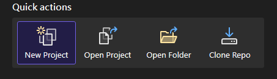

</details>

<details>
<summary>2. Create project using MAUI App Accelerator </summary


Select the **MAUI App Accelerator** to start the project wizard.


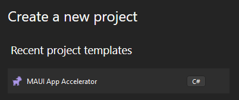

</details>

<details>
<summary>3. Configure the MAUI Project</summary


Enter the project name and solution name.
- **Make a note of the path where the project will be created**
- **Also solution Name this will be the namespace we will use later.**


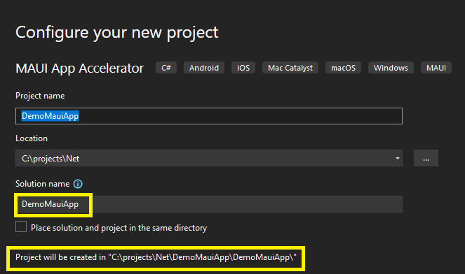

</details>

<details>
<summary>4. Select the version of .NET to use</summary


Select the .NET version to use either .Net 6 or .NET 7. 


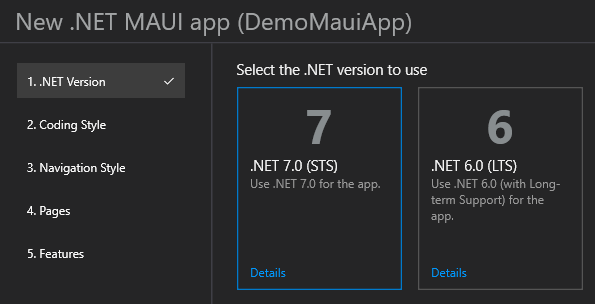

</details>

<details>
<summary>5. Select MVVM Toolkit as the coding style</summary


Select the MVVM Toolkit


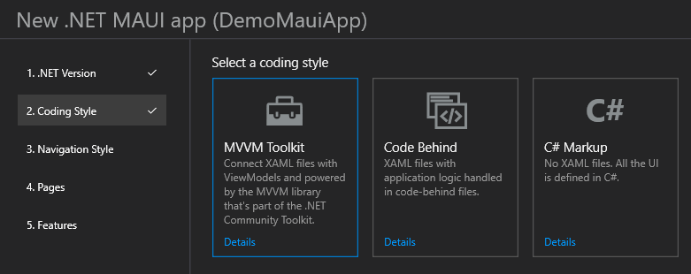

</details>

<details>
<summary>6. Select Flyout Menu for Navigation Style</summary


You can select Flyout or Tabs


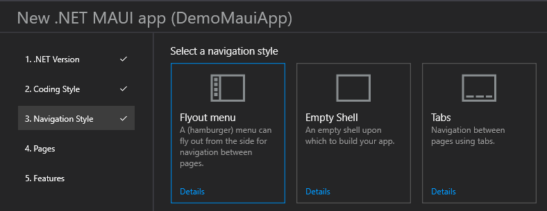

</details>

<details>
<summary>7. Click next on Pages</summary


You can just click next on the pages.


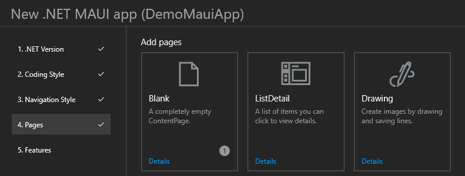

</details>

<details>
<summary>8. Configure Features</summary


Add the following libraries:
- MAUI Community Toolkit
- sqllite-net-pcl


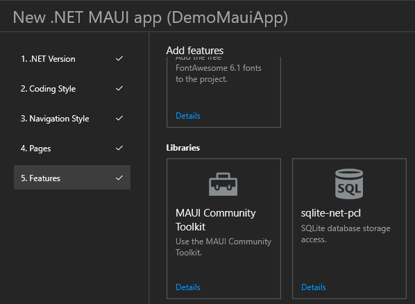

</details>

<details>
<summary>9. click Next to create the project</summary


MAUI App Accelerator will create the project


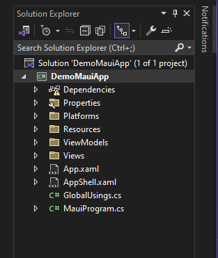

</details>

<details>
<summary>10. Add the route comment to the project</summary


- So that Maui-gen knows where to inject the route code it uses the following comment
```c#
//<%REGISTER_ROUTE%>
```


- You will need to add this to the file **AppShell.xaml.cs**
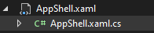
 - Add the comment just below the InitializeComponent and save changes.
```c#
public partial class AppShell : Shell
{
	public AppShell()
	{
		InitializeComponent();

        //<%REGISTER_ROUTE%>
    }
}
```


</details>


<details>
<summary>11. Add the singleton comment</summary


- So that Maui-gen knows where to inject the singleton code it uses the following comment
```c#
//<%REGISTER_SINGLETON%
```

- You will need to add this to the file **AppShell.xaml.cs**
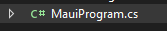
-  Add the comment just below the **builder.Services.AddSingleton<MainViewModel();** and save changes.
```c#
public static class MauiProgram {
    public static MauiApp CreateMauiApp() {
        var builder = MauiApp.CreateBuilder();
        builder
           .UseMauiApp<App()
            .UseMauiCommunityToolkit()
            .ConfigureFonts(fonts = {
                fonts.AddFont("OpenSans-Regular.ttf", "OpenSansRegular");
                fonts.AddFont("OpenSans-Semibold.ttf", "OpenSansSemibold");
            });

        builder.Services.AddSingleton<MainViewModel();

       //<%REGISTER_SINGLETON%

        builder.Services.AddSingleton<MainPage();

        return builder.Build();
    }
}
```

</details>


---

### Use Maui-gen to build the data forms using specified schema.


<details>
<summary>1. Set the output directory</summary


First we need to tell **Maui-gen** where to output the generated code to.
In this case we are pointing it to the **DemoMauiApp** created earlier.

**Note!** Make sure it is the directory where all the code is, see below.


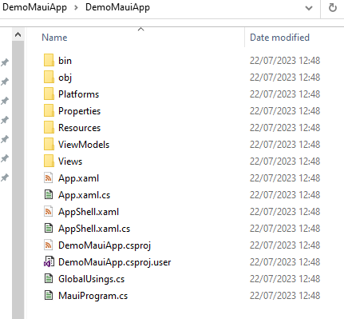


Run the following command to set the output directory. 
This is where Maui-gen will output the code to.

**Adjust the path to point to your project.**

```bash
maui-gen set output "C:\projects\Net\DemoMauiApp\DemoMauiApp"
```


</details>

<details>
<summary>2. Set the data schema to use</summary


Under your home directory where the **Maui-gen** templates are saved are some example schemas. we are going to set maui-gen to use one of these schemas.

```bash
maui-gen set schema "C:\Users\[user]\.maui-gen\examples\person_and_pet.yaml"
```


</details>

 
<details>
<summary>3. Check the paths are correct</summary


You can check what paths are set by using the following command this will open the config file in notepad.

```bash
maui-gen set edit
```


</details>

<details>
<summary>4. Install Nuget Packages</summary

You will need to install the following packages into the project.

- Use the maui-gen install tool 

```bash
maui-gen nuget install --output [project_path]
```

- Or if you set the output using the **maui-gen set output** then you can just use

```bash
maui-gen nuget install
```

- Or add each package using the nuget install in Visual Studio

```bash
SQLitePCLRaw.core
SQLitePCLRaw.bundle_green
SQLitePCLRaw.provider.sqlite3
SQLitePCLRaw.provider.dynamic_cdecl
SQLiteNetExtensions
SQLiteNetExtensions.Async

```

- Or open command prompt and cd to the project directory then paste the following code into the command prompt.
  
```bash
cd C:\projects\Net\MauiGenDemoApp\MauiGenDemoApp

dotnet add C:\projects\Net\MauiGenDemoApp\MauiGenDemoApp package SQLitePCLRaw.core
dotnet add package SQLitePCLRaw.bundle_green
dotnet add package SQLitePCLRaw.provider.sqlite3
dotnet add package SQLitePCLRaw.provider.dynamic_cdecl
dotnet add package SQLiteNetExtensions
dotnet add package SQLiteNetExtensions.Async
```


</details>

<details>
<summary>5. Generate the code based on the data schema</summary


Finally we are ready to generate the code you will need to pass in the project root namespace this is the ? "solution name" you entered when creating the Maui project.

you can also change the name space in the Data Schema file

```yaml
name_space: "DemoMauiApp"
resources:
  - App
  - Enums
  - AppShell
  - MauiProgram
```

```bash
maui-gen build --namespace "[solution name]"
```


</details>

<details>
<summary>6. Run the Maui Project</summary


Now that the code has been generated your can goto you Visual studio and you will see lots of new folders and files have been created.


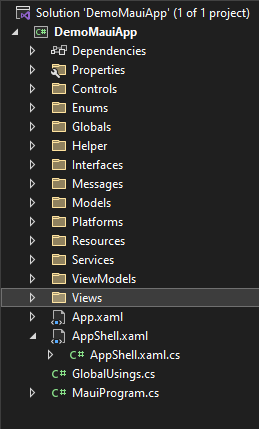


You can now simple run the project and you should see.


#### Main Menu
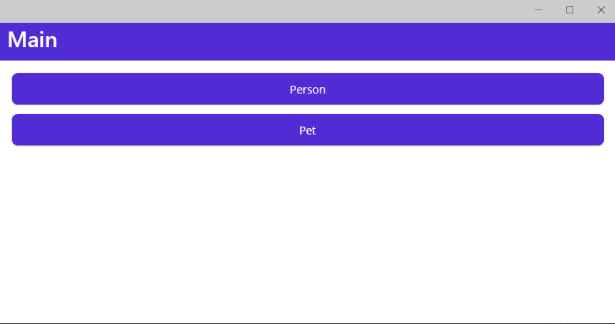

#### Edit Person Form
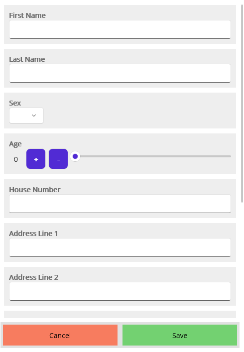

#### List Person Form
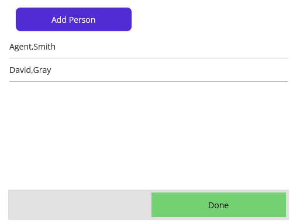


</details>

---

## Documents
[maui-gen CLI documents](./documents/maui-gen.md)


```bash
# Run maui-get to build template documents
maui-gen gen_docs
```
You can find the generated documents here.
* C:\Users\[User]\.maui-gen\documents\maui-gen.md
  
```bash
# Run maui-get to build template documents
maui-gen gen_template_docs
```
You can find the generated template documents here.
* C:\Users\[User]\.maui-gen\template_doc/Templates.md

## Videos

[]
(https://www.youtube.com/watch?v=2wSNWUeM1yE)


---

## Examples

<details>
<summary>Example Pictures</summary

#### Main Menu


#### Edit Person Form


#### List Person Form


</details>

---

## TODO
This is just a proof of concept to see if it draws any attention if it does then i'll put some time into it.


**If you do use it I would be interested to hear what you think about it.**


---

## History
### v0.1.0
- First Release
- 
### v0.1.1
- Added CLI Doc
- Embedded the template and examples (need to run maui-gen init all)
- Updated the project structure

### v0.1.2
- Fix the template path not using parameters or config

### v0.1.3
- Added nuget package install cmd

### v0.1.4
- Added template function to inject other templates
- Added Template Auto Generating documentation **maui-gen gen_template_docs**
---

## License
Maui-gen is Apache 2.0 licensed.
